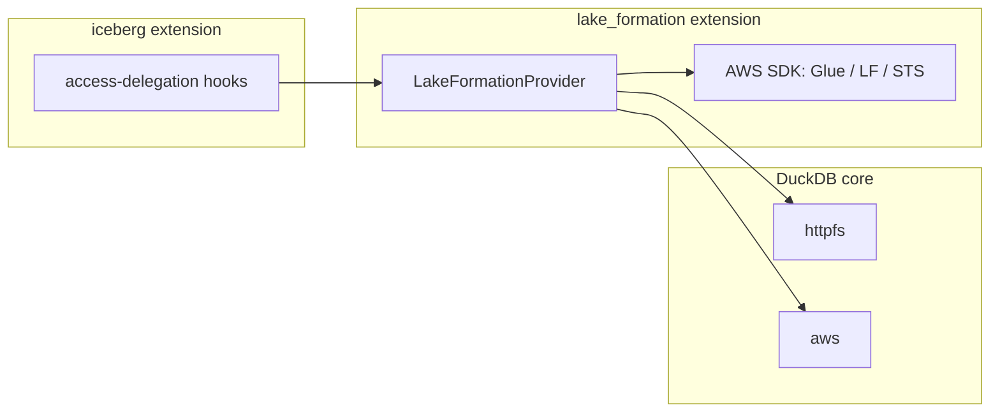

# duckdb-lake-formation

`lake_formation` is a DuckDB community extension that enforces [AWS Lake Formation](https://aws.amazon.com/lake-formation/) row-level data filters when reading Glue-managed Apache Iceberg tables. It is a thin, AWS-specific layer on top of the core [`iceberg`](https://github.com/duckdb/duckdb-iceberg) extension: all AWS SDK usage (Glue, Lake Formation, STS) lives here, and `duckdb-iceberg` carries no Lake Formation code.

## How it works

The extension registers an access-delegation provider with the `iceberg` extension through a generic plugin registry that lives on DuckDB's database-wide object cache. When a catalog is attached in `lake_formation` mode, the provider participates in the Iceberg scan lifecycle for each table it reads:

1. **Policy discovery** — fetches the caller's effective data-filter grant via Glue `GetUnfilteredTableMetadata`.
2. **Scoped credentials** — vends short-lived, filter-scoped S3 credentials via Lake Formation `GetTemporaryGlue*Credentials`, refreshed per partition during manifest walks.
3. **Mandatory row filter** — installs the Lake Formation row filter as a mandatory scan filter that user `WHERE` predicates cannot widen.



## Usage

`LOAD lake_formation` auto-loads `iceberg`, `httpfs`, and `aws`, so you only need to load this extension. Always load it **before** attaching a catalog in Lake Formation mode.

```sql
INSTALL iceberg;
INSTALL lake_formation FROM community;
LOAD lake_formation;  -- auto-loads iceberg, httpfs, aws

-- Base AWS identity (credential chain + STS AssumeRole) as a standard S3 secret:
CREATE SECRET glue_lf_secret (
    TYPE S3,
    PROVIDER credential_chain,
    CHAIN 'sts',
    ASSUME_ROLE_ARN 'arn:aws:iam::123456789012:role/my-lf-caller'
);

ATTACH '123456789012' AS lf (
    TYPE ICEBERG,
    ENDPOINT_TYPE 'GLUE',
    ACCESS_DELEGATION_MODE 'lake_formation',  -- handled by this extension
    LF_SESSION_TAG 'my-app'                   -- parsed only by this extension
);

SELECT count(*) FROM lf.my_db.my_table;
```

`ACCESS_DELEGATION_MODE 'lake_formation'` is a generic key understood by `iceberg`; the `LF_SESSION_TAG` option is ignored by `iceberg` and validated by this extension.

## Limitations

- **Row-level filters only.** Column-level and cell-level Lake Formation grants are rejected in v1.
- **Glue catalogs only** (`ENDPOINT_TYPE 'GLUE'`).
- **Not available on WebAssembly** (`wasm_*`) or `windows_amd64_mingw`.

## Building

This extension compiles against the `duckdb-iceberg` public headers but does not link the iceberg binary — `iceberg` is loaded as its own extension at runtime (`DONT_LINK`). The AWS SDK (Glue, Lake Formation, STS) is pulled in through `vcpkg.json` and is the only place in the stack that needs those components.

```bash
git clone --recurse-submodules https://github.com/REPLACE_WITH_ORG/duckdb-lake-formation
cd duckdb-lake-formation
make
```

The build needs the `iceberg` headers that contain the access-delegation hooks. Until those hooks are merged and a pinned `GIT_TAG` is set in `extension_config.cmake`, point the build at a local `duckdb-iceberg` checkout that contains them:

```bash
make ICEBERG_SRC_DIR=/path/to/duckdb-iceberg
```

By default `ICEBERG_SRC_DIR` resolves to a sibling `../duckdb-iceberg` checkout.

> **Known integration task:** `extension_config.cmake` still has a placeholder `GIT_TAG` (`REPLACE_WITH_PINNED_HOOK_COMMIT`). Once the access-delegation hook PR lands in `duckdb-iceberg`, pin that commit and the local `ICEBERG_SRC_DIR` override becomes optional.

## Testing

SQL logic tests live in `test/sql/lakeformation`. The cloud tests require a provisioned Lake Formation environment (see `scripts/setup_lf_data_filters.py`) and a set of `ICEBERG_LF_*` environment variables; they run in CI via `.github/workflows/CloudTesting.yml` on demand.

```bash
make test
```

## License

Apache-2.0.
